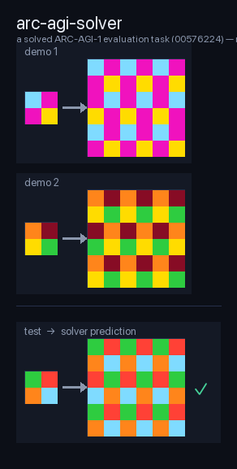
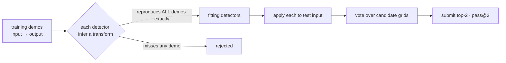

# arc-agi-solver

**A verification-based detector ensemble for [ARC-AGI](https://arcprize.org) — every rule must reproduce all training demos exactly before it's allowed to guess.**

No cloud, no frontier-model APIs. Built and benchmarked end-to-end on a laptop, in keeping with the ARC Prize rules.



---

## Approach

The solver is an **ensemble of ~320 rule detectors**. Each detector looks at a task's training input/output demos and tries to infer a single transformation. The engine is deliberately strict:

1. **Fit** — a detector is only accepted if the transform it infers reproduces **every** training output *exactly*. A detector that gets even one demo wrong is discarded for that task.
2. **Vote** — every *fitting* detector is applied to the test input. Identical candidate grids pool their votes; ties break toward the more specific/reliable detector.
3. **Pass@2** — the top two distinct candidates are submitted (ARC allows two attempts per output).

The key property falls out of step 1: **the ensemble cannot hardcode answers.** A detector never sees the test output, and it is only ever used on a task where it has already re-derived the correct rule from the visible demos. Mis-fits reject themselves. This makes each per-task number below a measurement of *generalization from demos*, not memorization. (Iterating detector coverage against a fixed set is a separate, coarser form of overfitting — see the ARC-1 eval caveat below.)



Detectors are pure functions (`train -> transform_fn | None`), numpy + stdlib only, and defensive by construction — a broken detector returns `None` and is skipped, never crashing the ensemble.

---

## Results

Measured with the harness in this repo (`run.py`), scored by ARC Prize rules (a test output is solved if the ground truth is among the two submitted attempts). Full append-only log in [`RESULTS.md`](RESULTS.md).

| Set | Baseline (15 detectors) | Current | What it measures |
|---|---|---|---|
| **ARC-1 eval** | 0.50% | **51.75%** (321 dets) | Standard benchmark — *iterated against*, so treat as in-distribution |
| **ARC-1 train** | 6.25% | ~29.5% (179 dets) | Last measured mid-build; not re-run at 321 detectors |
| **ARC-2 train** (held-out) | — | **33.90%** (321 dets) | Fully unseen while building — the honest generalization signal |
| **ARC-2 eval** (held-out, hard) | — | **1.67%** (321 dets) | The novel-reasoning wall |

**ARC-1 eval, round by round** as detectors were added:

```
0.50%  →  14.25%  →  26.50%  →  27.50%  →  41.00%  →  51.75%
baseline   round1    round2    round3b   round4     round5
 15 dets   129       179       220       276        321
```

**ARC-2 train** climbed in step: 21.00% → 23.10% → 29.10% → **33.90%**.

### The honest takeaway

Symbolic detectors capture *known* transformation families well — about half of the standard ARC-1 eval set, about a third of the never-seen ARC-2 train set. But on **ARC-2 eval they score 1.67%** (2 of 120 tasks), and that number is the whole story.

ARC-2 eval is designed to require *novel* reasoning per task, and it remains one of the field's hardest open benchmarks. Hand-written detectors, however many you add, plateau against tasks whose rules were never anticipated. Two caveats keep the table honest:

- ARC-1 eval was **iterated against** (each round added detectors for tasks it had been missing), so its 51.75% is an in-distribution number. The unseen **ARC-2 train (33.90%)** is the cleaner read on generalization.
- The ARC-1 train figure (~29.5%) was last measured at 179 detectors and not re-run at the full 321, so it is a conservative, mid-build snapshot rather than a current-config number.
- Getting past the ARC-2 eval wall needs a different lever than more detectors — test-time training, LLM-guided program synthesis, or a much larger DSL under search. That's the roadmap, not a tweak.

---

## Architecture & file map

```
arc-agi-solver/
├── harness.py        # data loading + engine (fit → vote → pass@2) + benchmark/scoring
├── detectors.py      # 15 base detectors (geometry, color-map, tiling, scaling,
│                     #   crop, border, panel logic, objects, gravity, …)
├── registry.py       # assembles base detectors + every gen/*.py plugin into one ensemble
├── gen/              # plugin detector families, each exposing a DETECTORS list:
│   ├── sym_repair.py         #   symmetry / occlusion repair
│   ├── periodicity.py        #   periodic tiling & pattern completion
│   ├── panel_select.py       #   pick / overlay one panel of a multi-panel grid
│   ├── obj_recolor.py        #   object recolor / select / crop
│   ├── counting.py           #   render counts (cells, objects, histograms)
│   ├── denoise.py            #   remove noise / restore a clean pattern
│   ├── lines_flood.py        #   line drawing, flood fill
│   ├── mirror_concat.py      #   mirror-and-concatenate
│   ├── shape_dict.py         #   learned shape → shape dictionary
│   ├── search.py             #   small compositional program search
│   └── …                     #   ~42 plugin modules in total
├── run.py            # benchmark a set, append a line to RESULTS.md
├── selftest.py       # measure ONE plugin's marginal contribution in isolation
├── show.py           # print a task's train/test grids to the terminal
├── _hero.py          # regenerate the README hero image (docs/solved_example.png)
├── RESULTS.md        # append-only benchmark log (source of the table above)
├── ttt/              # exploratory test-time-training pipeline (see roadmap)
└── arc1/  arc2/      # the ARC-AGI-1 / ARC-AGI-2 datasets (fetched separately — see Setup)
```

The engine lives entirely in `harness.py`: `fitting_transforms` (verify against demos), `candidates_for` (apply + vote), `solve_task` (top-2), `benchmark` (score). Everything else is detectors.

---

## Setup

The datasets are not vendored (they have their own repos). Clone them into place — the harness reads tasks from `arc1/data/{training,evaluation}` and `arc2/data/{training,evaluation}`:

```bash
git clone https://github.com/fchollet/ARC-AGI       arc1
git clone https://github.com/arcprize/ARC-AGI-2     arc2
```

Dependencies: **`numpy`** and the Python standard library. Nothing else is required to run the solver.

## Run it

```bash
# Benchmark a set. <tag> labels the run in RESULTS.md.
python run.py <tag> arc1-eval      # or: arc1-train | arc2-eval | arc2-train

# e.g.
python run.py mychange arc2-train
# → mychange | arc2-train | tasks 339/1000 (33.90%) | outputs@2 358/1076 (33.27%) | dets 321 | 139.4s
```

```bash
# Measure what a single detector family adds, in isolation (base + that module only):
python selftest.py gen.sym_repair

# Eyeball a specific task:
python show.py <task_id>
```

**Adding a detector:** drop a `gen/<name>.py` exposing a module-level `DETECTORS` list of `det(train) -> transform_fn | None` functions. `registry.py` picks it up automatically; the harness verifies it against the demos before it's ever trusted.

---

## Roadmap / honest limitations

**What this is.** A clean, fast, fully-verified symbolic baseline. Per-task answers cannot be hardcoded (the verification gate makes that impossible), it's reproducible on commodity hardware, and it establishes a real generalization number on unseen tasks (ARC-2 train ≈ 34%).

**Where it stops.**

- **ARC-2 eval (1.67%) is the wall.** These tasks demand rules no detector was written to expect. Adding more hand-written detectors has diminishing returns here — you can't enumerate novelty. This is a hard open problem across the field, not a gap unique to this approach; even leading systems remain in the low single digits on ARC-2 eval.
- **ARC-1 eval is optimized-against.** Its 51.75% is inflated relative to true generalization. The unseen ARC-2 train figure is the number to trust.
- **Detector coverage is uneven** across transformation families; the long tail of rare rules is expensive to reach one detector at a time.

**Next levers** (in rough order of expected payoff, none of them "more detectors"):

1. **Test-time training** — per-task LoRA on augmented demos. An exploratory pipeline exists in `ttt/`; it runs end-to-end on a Mac, but tuning and more compute (cloud) are needed before it produces competitive scores. It has not yet been shown to move the ARC-2 numbers.
2. **LLM-guided program synthesis** — use a model to *propose* candidate transforms, then keep this repo's exact-verification gate to reject hallucinations.
3. **A larger DSL under proper search** — grow the primitive set and search compositions, rather than enumerating whole rules by hand.

The verification-first engine here is meant to survive all three: whatever proposes a transform — a detector, a search, or a model — still has to reproduce every demo before it earns a vote.

---

*ARC-AGI is a benchmark by the [ARC Prize Foundation](https://arcprize.org). This is an independent solver, not affiliated with or endorsed by them.*
